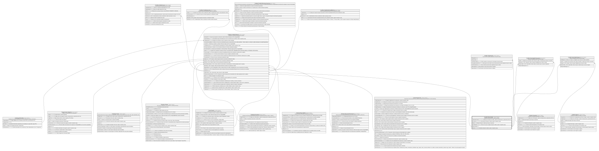

# Credito.TipoCredito

## Description

Catalogo de tipos/lineas de credito ofrecidas.

## Columns

| Name              | Type         | Default                                      | Nullable | Children                                                                                                                                                                                                                      | Parents | Comment                                                                          |
| ----------------- | ------------ | -------------------------------------------- | -------- | ----------------------------------------------------------------------------------------------------------------------------------------------------------------------------------------------------------------------------- | ------- | -------------------------------------------------------------------------------- |
| CodigoTipoCredito | varchar(15)  |                                              | false    |                                                                                                                                                                                                                               |         | Codigo unico del tipo de credito, usado en transacciones y operaciones del core. |
| Descripcion       | varchar(250) |                                              | true     |                                                                                                                                                                                                                               |         | Descripcion del tipo de credito, usado en reportes y logs.                       |
| Estado            | char         | (('A') collate SQL_Latin1_General_CP1_CI_AS) | false    |                                                                                                                                                                                                                               |         | Estado del tipo de credito que incluye si esta (I/A).                            |
| FechaRegistro     | datetime2    | (sysdatetime())                              | false    |                                                                                                                                                                                                                               |         | Fecha en la que se registro el tipo de credito, usado en reportes y logs.        |
| IdTipoCredito     | int          |                                              | false    | [Credito.CreditoSolicitud](Credito.CreditoSolicitud.md) [Credito.TasaInteres](Credito.TasaInteres.md) [Credito.TipoCreditoImpuesto](Credito.TipoCreditoImpuesto.md) [Credito.TipoCreditoSeguro](Credito.TipoCreditoSeguro.md) |         |                                                                                  |
| Nombre            | varchar(60)  |                                              | false    |                                                                                                                                                                                                                               |         | Nombre del tipo de credito, usado en reportes y logs.                            |

## Viewpoints

| Name                      | Definition                                                            |
| ------------------------- | --------------------------------------------------------------------- |
| [Credito](viewpoint-7.md) | Aprobacion de credito, plan de pagos, garantias y politica de riesgo. |

## Constraints

| Name                  | Type        | Definition                                                               |
| --------------------- | ----------- | ------------------------------------------------------------------------ |
| CK_TipoCredito_Estado | CHECK       | CHECK([Estado]='I' OR [Estado]='A')                                      |
| PK_TipoCredito        | PRIMARY KEY | CLUSTERED, unique, part of a PRIMARY KEY constraint, [ IdTipoCredito ]   |
| UQ_TipoCredito_Codigo | UNIQUE      | NONCLUSTERED, unique, part of a UNIQUE constraint, [ CodigoTipoCredito ] |

## Indexes

| Name                  | Definition                                                               |
| --------------------- | ------------------------------------------------------------------------ |
| PK_TipoCredito        | CLUSTERED, unique, part of a PRIMARY KEY constraint, [ IdTipoCredito ]   |
| UQ_TipoCredito_Codigo | NONCLUSTERED, unique, part of a UNIQUE constraint, [ CodigoTipoCredito ] |

## Relations

---

> Generated by [tbls](https://github.com/k1LoW/tbls)
