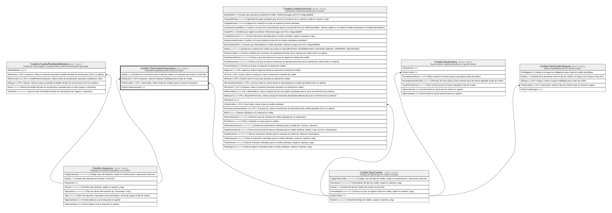

# Credito.TipoCreditoImpuesto

## Description

Impuestos habilitados para un tipo de credito.

## Columns

| Name                  | Type | Default                                      | Nullable | Children | Parents                                       | Comment                                                                                   |
| --------------------- | ---- | -------------------------------------------- | -------- | -------- | --------------------------------------------- | ----------------------------------------------------------------------------------------- |
| Estado                | char | (('A') collate SQL_Latin1_General_CP1_CI_AS) | false    |          |                                               | Estado de la asociacion entre el tipo de credito y el impuesto que incluye si esta (I/A). |
| IdImpuesto            | int  |                                              | false    |          | [Credito.Impuesto](Credito.Impuesto.md)       | FK a Impuesto, indica el impuesto habilitado para el tipo de credito.                     |
| IdTipoCredito         | int  |                                              | false    |          | [Credito.TipoCredito](Credito.TipoCredito.md) | FK a TipoCredito, indica el tipo de credito al que se asocia el impuesto.                 |
| IdTipoCreditoImpuesto | int  |                                              | false    |          |                                               |                                                                                           |

## Viewpoints

| Name                      | Definition                                                            |
| ------------------------- | --------------------------------------------------------------------- |
| [Credito](viewpoint-7.md) | Aprobacion de credito, plan de pagos, garantias y politica de riesgo. |

## Constraints

| Name                               | Type        | Definition                                                                                                       |
| ---------------------------------- | ----------- | ---------------------------------------------------------------------------------------------------------------- |
| CK_TipoCreditoImpuesto_Estado      | CHECK       | CHECK([Estado]='I' OR [Estado]='A')                                                                              |
| FK_TipoCreditoImpuesto_Impuesto    | FOREIGN KEY | FOREIGN KEY(IdImpuesto) REFERENCES Credito.Impuesto(IdImpuesto) ON UPDATE NO_ACTION ON DELETE NO_ACTION          |
| FK_TipoCreditoImpuesto_TipoCredito | FOREIGN KEY | FOREIGN KEY(IdTipoCredito) REFERENCES Credito.TipoCredito(IdTipoCredito) ON UPDATE NO_ACTION ON DELETE NO_ACTION |
| PK_TipoCreditoImpuesto             | PRIMARY KEY | CLUSTERED, unique, part of a PRIMARY KEY constraint, [ IdTipoCreditoImpuesto ]                                   |
| UQ_TipoCreditoImpuesto             | UNIQUE      | NONCLUSTERED, unique, part of a UNIQUE constraint, [ IdTipoCredito, IdImpuesto ]                                 |

## Indexes

| Name                   | Definition                                                                       |
| ---------------------- | -------------------------------------------------------------------------------- |
| PK_TipoCreditoImpuesto | CLUSTERED, unique, part of a PRIMARY KEY constraint, [ IdTipoCreditoImpuesto ]   |
| UQ_TipoCreditoImpuesto | NONCLUSTERED, unique, part of a UNIQUE constraint, [ IdTipoCredito, IdImpuesto ] |

## Relations

---

> Generated by [tbls](https://github.com/k1LoW/tbls)
