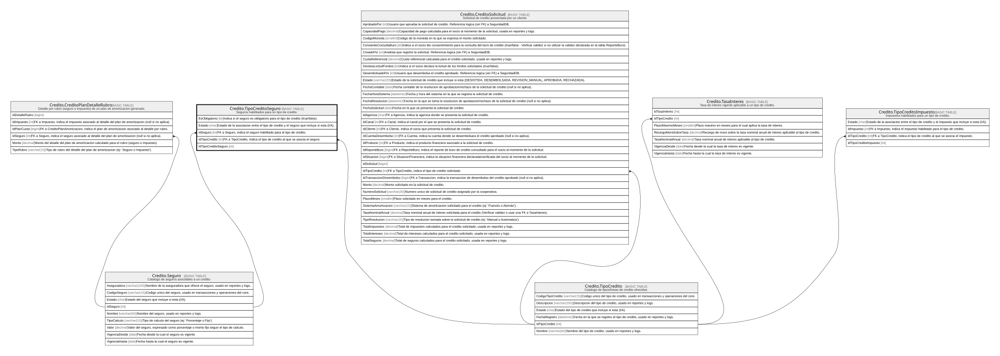

# Credito.TipoCreditoSeguro

## Description

Seguros habilitados para un tipo de credito.

## Columns

| Name                | Type | Default                                      | Nullable | Children | Parents                                       | Comment                                                                                 |
| ------------------- | ---- | -------------------------------------------- | -------- | -------- | --------------------------------------------- | --------------------------------------------------------------------------------------- |
| EsObligatorio       | bit  | ((1))                                        | false    |          |                                               | Indica si el seguro es obligatorio para el tipo de credito (true/false).                |
| Estado              | char | (('A') collate SQL_Latin1_General_CP1_CI_AS) | false    |          |                                               | Estado de la asociacion entre el tipo de credito y el seguro que incluye si esta (I/A). |
| IdSeguro            | int  |                                              | false    |          | [Credito.Seguro](Credito.Seguro.md)           | FK a Seguro, indica el seguro habilitado para el tipo de credito.                       |
| IdTipoCredito       | int  |                                              | false    |          | [Credito.TipoCredito](Credito.TipoCredito.md) | FK a TipoCredito, indica el tipo de credito al que se asocia el seguro.                 |
| IdTipoCreditoSeguro | int  |                                              | false    |          |                                               |                                                                                         |

## Viewpoints

| Name                      | Definition                                                            |
| ------------------------- | --------------------------------------------------------------------- |
| [Credito](viewpoint-7.md) | Aprobacion de credito, plan de pagos, garantias y politica de riesgo. |

## Constraints

| Name                             | Type        | Definition                                                                                                       |
| -------------------------------- | ----------- | ---------------------------------------------------------------------------------------------------------------- |
| CK_TipoCreditoSeguro_Estado      | CHECK       | CHECK([Estado]='I' OR [Estado]='A')                                                                              |
| FK_TipoCreditoSeguro_Seguro      | FOREIGN KEY | FOREIGN KEY(IdSeguro) REFERENCES Credito.Seguro(IdSeguro) ON UPDATE NO_ACTION ON DELETE NO_ACTION                |
| FK_TipoCreditoSeguro_TipoCredito | FOREIGN KEY | FOREIGN KEY(IdTipoCredito) REFERENCES Credito.TipoCredito(IdTipoCredito) ON UPDATE NO_ACTION ON DELETE NO_ACTION |
| PK_TipoCreditoSeguro             | PRIMARY KEY | CLUSTERED, unique, part of a PRIMARY KEY constraint, [ IdTipoCreditoSeguro ]                                     |
| UQ_TipoCreditoSeguro             | UNIQUE      | NONCLUSTERED, unique, part of a UNIQUE constraint, [ IdTipoCredito, IdSeguro ]                                   |

## Indexes

| Name                 | Definition                                                                     |
| -------------------- | ------------------------------------------------------------------------------ |
| PK_TipoCreditoSeguro | CLUSTERED, unique, part of a PRIMARY KEY constraint, [ IdTipoCreditoSeguro ]   |
| UQ_TipoCreditoSeguro | NONCLUSTERED, unique, part of a UNIQUE constraint, [ IdTipoCredito, IdSeguro ] |

## Relations

---

> Generated by [tbls](https://github.com/k1LoW/tbls)
