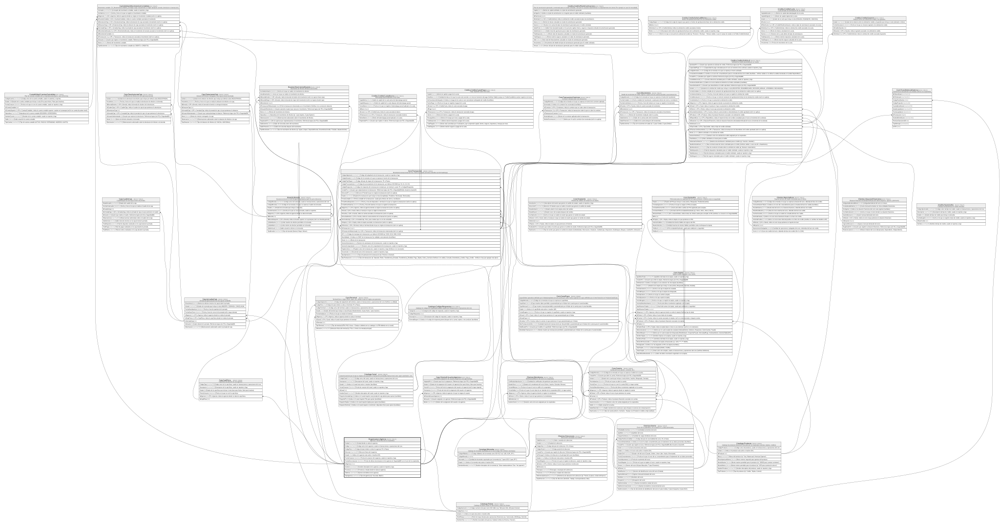

# Organizacion.Agencia

## Description

Agencia u oficina fisica de la cooperativa.

## Columns

| Name                | Type         | Default                                        | Nullable | Children                                                                                                                                                                                                                                                                                                                                                                                                                                                                                                  | Parents                               | Comment                                                                                    |
| ------------------- | ------------ | ---------------------------------------------- | -------- | --------------------------------------------------------------------------------------------------------------------------------------------------------------------------------------------------------------------------------------------------------------------------------------------------------------------------------------------------------------------------------------------------------------------------------------------------------------------------------------------------------- | ------------------------------------- | ------------------------------------------------------------------------------------------ |
| Ciudad              | varchar(50)  |                                                | false    |                                                                                                                                                                                                                                                                                                                                                                                                                                                                                                           |                                       | Ciudad donde se ubica la agencia.                                                          |
| Codigo              | varchar(10)  |                                                | false    |                                                                                                                                                                                                                                                                                                                                                                                                                                                                                                           |                                       | Codigo unico de la agencia, usado en transacciones y operaciones del core.                 |
| CodigoPais          | char         | (('ECU') collate SQL_Latin1_General_CP1_CI_AS) | false    |                                                                                                                                                                                                                                                                                                                                                                                                                                                                                                           | [Catalogo.Paises](Catalogo.Paises.md) | Codigo del pais donde se ubica la agencia, FK a Paises.                                    |
| Direccion           | varchar(250) |                                                | true     |                                                                                                                                                                                                                                                                                                                                                                                                                                                                                                           |                                       | Direccion fisica de la agencia.                                                            |
| Estado              | char         | (('A') collate SQL_Latin1_General_CP1_CI_AS)   | false    |                                                                                                                                                                                                                                                                                                                                                                                                                                                                                                           |                                       | Indica si la agencia esta activa o inactiva (I/A).                                         |
| FechaCreacion       | datetime2    | (sysdatetime())                                | false    |                                                                                                                                                                                                                                                                                                                                                                                                                                                                                                           |                                       | Fecha de creacion de la agencia, usado en reportes y logs.                                 |
| FechaSincronizacion | datetime2    | (sysdatetime())                                | false    |                                                                                                                                                                                                                                                                                                                                                                                                                                                                                                           |                                       | Fecha de ultima sincronizacion de la agencia en SeguridadDB con el core de la cooperativa. |
| IdAgencia           | char         |                                                | false    | [Boveda.Boveda](Boveda.Boveda.md) [Caja.CajaFisica](Caja.CajaFisica.md) [Caja.HistorialUsuariosAgencia](Caja.HistorialUsuariosAgencia.md) [Caja.JornadasCaja](Caja.JornadasCaja.md) [Clientes.Membresia](Clientes.Membresia.md) [Contabilidad.MovimientosContables](Contabilidad.MovimientosContables.md) [Core.Cuenta](Core.Cuenta.md) [Core.Tarjeta](Core.Tarjeta.md) [Core.Terminal](Core.Terminal.md) [Core.Transaccion](Core.Transaccion.md) [Credito.CreditoSolicitud](Credito.CreditoSolicitud.md) |                                       |                                                                                            |
| Nombre              | varchar(100) |                                                | false    |                                                                                                                                                                                                                                                                                                                                                                                                                                                                                                           |                                       | Nombre descriptivo de la agencia, usado en reportes y logs.                                |
| Provincia           | varchar(50)  |                                                | false    |                                                                                                                                                                                                                                                                                                                                                                                                                                                                                                           |                                       | Provincia o estado donde se ubica la agencia.                                              |
| Telefono            | varchar(15)  |                                                | true     |                                                                                                                                                                                                                                                                                                                                                                                                                                                                                                           |                                       | Numero de telefono de la agencia.                                                          |
| TipoAgencia         | varchar(10)  |                                                | false    |                                                                                                                                                                                                                                                                                                                                                                                                                                                                                                           |                                       | Tipo de agencia (ej:' Sucursal, Matriz').                                                  |

## Viewpoints

| Name                           | Definition                                          |
| ------------------------------ | --------------------------------------------------- |
| [Organizacion](viewpoint-1.md) | Estructura administrativa/fisica de la cooperativa. |

## Constraints

| Name              | Type        | Definition                                                                                             |
| ----------------- | ----------- | ------------------------------------------------------------------------------------------------------ |
| CK_Agencia_Estado | CHECK       | CHECK([Estado]='C' OR [Estado]='I' OR [Estado]='A')                                                    |
| CK_Agencia_Tipo   | CHECK       | CHECK([TipoAgencia]='Sucursal' OR [TipoAgencia]='Matriz')                                              |
| FK_Agencia_Pais   | FOREIGN KEY | FOREIGN KEY(CodigoPais) REFERENCES Catalogo.Paises(CodigoPais) ON UPDATE NO_ACTION ON DELETE NO_ACTION |
| PK_Agencia        | PRIMARY KEY | CLUSTERED, unique, part of a PRIMARY KEY constraint, [ IdAgencia ]                                     |
| UQ_Agencia_Codigo | UNIQUE      | NONCLUSTERED, unique, part of a UNIQUE constraint, [ Codigo ]                                          |

## Indexes

| Name              | Definition                                                         |
| ----------------- | ------------------------------------------------------------------ |
| PK_Agencia        | CLUSTERED, unique, part of a PRIMARY KEY constraint, [ IdAgencia ] |
| UQ_Agencia_Codigo | NONCLUSTERED, unique, part of a UNIQUE constraint, [ Codigo ]      |

## Relations

---

> Generated by [tbls](https://github.com/k1LoW/tbls)
