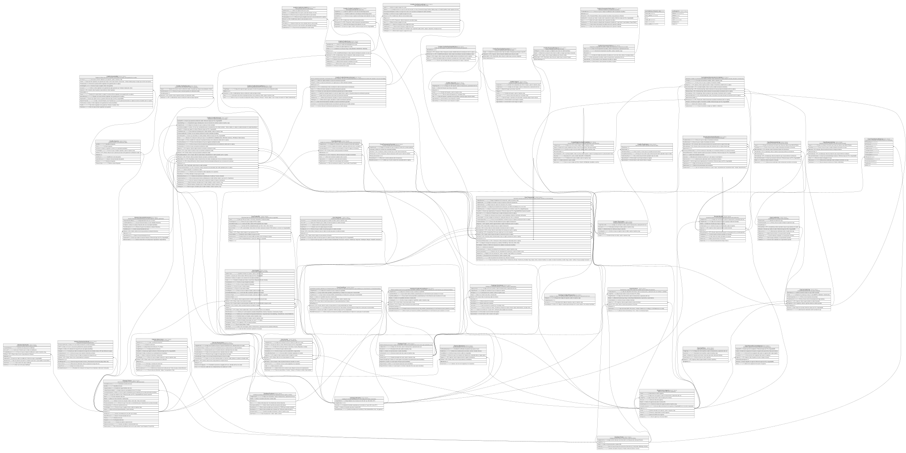

# CooperativaDB_V6

## Description

Core transaccional de una Cooperativa Financiera: cuentas, tarjetas, canales, caja y boveda, contabilidad, y aprobacion de creditos. Las columnas *CreadoPor / *RegistradoPor / IdUsuario* que aparecen sin FK son referencias logicas a SeguridadDB.dbo.Usuarios, que vive en una base de Azure SQL separada.  

## Viewpoints

| Name                           | Description                                                           |
| ------------------------------ | --------------------------------------------------------------------- |
| [Catalogo](viewpoint-0.md)     | Catalogos y dominios transversales compartidos por todos los modulos. |
| [Organizacion](viewpoint-1.md) | Estructura administrativa/fisica de la cooperativa.                   |
| [Clientes](viewpoint-2.md)     | Datos del socio y su perfil de riesgo/cumplimiento.                   |
| [Core](viewpoint-3.md)         | Cuentas, tarjetas, canales y el motor transaccional.                  |
| [Boveda](viewpoint-4.md)       | Efectivo a nivel boveda/agencia (no ventanilla).                      |
| [Caja](viewpoint-5.md)         | Operacion de ventanilla, jornadas, dotaciones y cuadres.              |
| [Contabilidad](viewpoint-6.md) | Plan de cuentas y asientos contables.                                 |
| [Credito](viewpoint-7.md)      | Aprobacion de credito, plan de pagos, garantias y politica de riesgo. |

## Tables

| Name                                                                      | Columns | Comment                                                                                                                                                                     | Type        |
| ------------------------------------------------------------------------- | ------- | --------------------------------------------------------------------------------------------------------------------------------------------------------------------------- | ----------- |
| [Boveda.Boveda](Boveda.Boveda.md)                                         | 11      | Boveda de efectivo a nivel de agencia (jerarquia propia via auto-referencia).                                                                                               | BASIC TABLE |
| [Boveda.MovimientoBoveda](Boveda.MovimientoBoveda.md)                     | 14      | Movimiento de efectivo de/hacia una boveda.                                                                                                                                 | BASIC TABLE |
| [Caja.CajaFisica](Caja.CajaFisica.md)                                     | 6       | Caja fisica de atencion en una agencia.                                                                                                                                     | BASIC TABLE |
| [Caja.CuadreCaja](Caja.CuadreCaja.md)                                     | 10      | Cuadre/arqueo de una caja al cierre de jornada.                                                                                                                             | BASIC TABLE |
| [Caja.DevolucionesCaja](Caja.DevolucionesCaja.md)                         | 9       | Devolucion de efectivo de una caja hacia boveda.                                                                                                                            | BASIC TABLE |
| [Caja.DotacionesCaja](Caja.DotacionesCaja.md)                             | 9       | Dotacion de efectivo entregada a una caja al iniciar la jornada.                                                                                                            | BASIC TABLE |
| [Caja.HistorialUsuariosAgencia](Caja.HistorialUsuariosAgencia.md)         | 8       | Historial de asignacion de usuarios (cajeros) a una agencia/caja.                                                                                                           | BASIC TABLE |
| [Caja.JornadasCaja](Caja.JornadasCaja.md)                                 | 9       | Jornada de apertura/cierre de una caja de ventanilla.                                                                                                                       | BASIC TABLE |
| [Catalogo.Canal](Catalogo.Canal.md)                                       | 10      | Canal de atencion por el que se origina una operacion o transaccion (ventanilla, banca movil, web, cajero automatico, etc).                                                 | BASIC TABLE |
| [Catalogo.CodigosRespuesta](Catalogo.CodigosRespuesta.md)                 | 4       | Catalogo de codigos de respuesta/resultado usados por transacciones y operaciones del core.                                                                                 | BASIC TABLE |
| [Catalogo.Comisiones](Catalogo.Comisiones.md)                             | 13      | Catalogo de comisiones aplicables a productos, canales u operaciones.                                                                                                       | BASIC TABLE |
| [Catalogo.Monedas](Catalogo.Monedas.md)                                   | 5       | Catalogo de monedas soportadas por el core (codigo ISO, simbolo, decimales).                                                                                                | BASIC TABLE |
| [Catalogo.Paises](Catalogo.Paises.md)                                     | 5       | Catalogo de paises usado en direcciones y datos de clientes.                                                                                                                | BASIC TABLE |
| [Catalogo.Producto](Catalogo.Producto.md)                                 | 9       | Catalogo de productos financieros ofrecidos por la cooperativa (cuentas, tarjetas, creditos).                                                                               | BASIC TABLE |
| [Catalogo.ProductoCanalCupo](Catalogo.ProductoCanalCupo.md)               | 10      | Relacion producto-canal con los cupos/limites operativos habilitados, parametrizados y definidos por el ente financiero; por canal y por producto.                          | BASIC TABLE |
| [Clientes.Cliente](Clientes.Cliente.md)                                   | 21      | Socio de la cooperativa, con su perfil KYC y datos personales.                                                                                                              | BASIC TABLE |
| [Clientes.ClientesHis](Clientes.ClientesHis.md)                           | 9       | Historial de cambios sobre los datos del cliente.                                                                                                                           | BASIC TABLE |
| [Clientes.Direcciones](Clientes.Direcciones.md)                           | 14      | Direcciones asociadas a un cliente.                                                                                                                                         | BASIC TABLE |
| [Clientes.EvaluacionCliente](Clientes.EvaluacionCliente.md)               | 12      | Evaluacion de riesgo/scoring del cliente.                                                                                                                                   | BASIC TABLE |
| [Clientes.Membresia](Clientes.Membresia.md)                               | 8       | Membresia/afiliacion del socio a la cooperativa.                                                                                                                            | BASIC TABLE |
| [Clientes.ReporteBuro](Clientes.ReporteBuro.md)                           | 11      | Reporte de buro de credito consultado para el cliente.                                                                                                                      | BASIC TABLE |
| [Clientes.SituacionFinanciera](Clientes.SituacionFinanciera.md)           | 10      | Situacion financiera declarada/verificada del cliente (ingresos, egresos, patrimonio).                                                                                      | BASIC TABLE |
| [Contabilidad.CuentasContables](Contabilidad.CuentasContables.md)         | 9       | Plan de cuentas contables de la cooperativa (jerarquico, auto-referencia).                                                                                                  | BASIC TABLE |
| [Contabilidad.MovimientosContables](Contabilidad.MovimientosContables.md) | 13      | Movimiento contable. CK_MovimientosContables_UnOrigen exige exactamente un origen (dotacion, boveda, devolucion o transaccion).                                             | BASIC TABLE |
| [Core.CanalCupo](Core.CanalCupo.md)                                       | 11      | Cupos/limites operativos definidos por el titular/propietario de una cuenta por canal. Nunca superan los cupos definidos por el ente financiero en ProductoCanalCupo.       | BASIC TABLE |
| [Core.Cuenta](Core.Cuenta.md)                                             | 14      | Cuenta del socio (ahorro, corriente, etc.).                                                                                                                                 | BASIC TABLE |
| [Core.Movimiento](Core.Movimiento.md)                                     | 10      | Detalle de movimiento de saldo, ingreso o egreso de una cuenta asociado a una transaccion.                                                                                  | BASIC TABLE |
| [Core.Tarjeta](Core.Tarjeta.md)                                           | 27      | Tarjeta emitida asociada a una cuenta.                                                                                                                                      | BASIC TABLE |
| [Core.TarjetaHis](Core.TarjetaHis.md)                                     | 10      | Historial de cambios de estado de una tarjeta.                                                                                                                              | BASIC TABLE |
| [Core.TarjetaPin](Core.TarjetaPin.md)                                     | 11      | PIN/credenciales de seguridad de una tarjeta (Evaluar si deberia estar en seguridad).                                                                                       | BASIC TABLE |
| [Core.Terminal](Core.Terminal.md)                                         | 10      | Terminal fisico o logico (POS, cajero, etc.) desde el que se origina una operacion.                                                                                         | BASIC TABLE |
| [Core.Transaccion](Core.Transaccion.md)                                   | 29      | Movimiento transaccional del core, todos los canales (incluida ventanilla via IdJornadaCaja).                                                                               | BASIC TABLE |
| [Core.TransaccionComision](Core.TransaccionComision.md)                   | 7       | Comision cobrada sobre una transaccion.                                                                                                                                     | BASIC TABLE |
| [Core.TransferenciaExterna](Core.TransferenciaExterna.md)                 | 12      | Transferencia hacia/desde una entidad externa a la cooperativa.                                                                                                             | BASIC TABLE |
| [Credito.CreditoCuota](Credito.CreditoCuota.md)                           | 11      | Cuota del plan de amortizacion de un credito.                                                                                                                               | BASIC TABLE |
| [Credito.CreditoCuotaAbono](Credito.CreditoCuotaAbono.md)                 | 8       | Abono/pago parcial aplicado a una cuota.                                                                                                                                    | BASIC TABLE |
| [Credito.CreditoCuotaMora](Credito.CreditoCuotaMora.md)                   | 9       | Mora generada sobre una cuota vencida.                                                                                                                                      | BASIC TABLE |
| [Credito.CreditoCuotaPago](Credito.CreditoCuotaPago.md)                   | 12      | Pago registrado sobre una cuota.                                                                                                                                            | BASIC TABLE |
| [Credito.CreditoGarante](Credito.CreditoGarante.md)                       | 5       | Relacion entre una solicitud de credito y sus garantes.                                                                                                                     | BASIC TABLE |
| [Credito.CreditoPlanAmortizacion](Credito.CreditoPlanAmortizacion.md)     | 13      | Plan de amortizacion generado y versionado para un credito solicitado, este plan se actualiza dependiendo el comportamiento del cliente (Por ejemplo en caso de morosidad). | BASIC TABLE |
| [Credito.CreditoPlanDetalleRubro](Credito.CreditoPlanDetalleRubro.md)     | 6       | Detalle por rubro (seguro o impuesto) de un plan de amortizacion generado.                                                                                                  | BASIC TABLE |
| [Credito.CreditoSolicitud](Credito.CreditoSolicitud.md)                   | 32      | Solicitud de credito presentada por un cliente.                                                                                                                             | BASIC TABLE |
| [Credito.CreditoSolicitudMotivo](Credito.CreditoSolicitudMotivo.md)       | 5       | Motivo de aprobacion/rechazo de una solicitud de credito.                                                                                                                   | BASIC TABLE |
| [Credito.Garante](Credito.Garante.md)                                     | 10      | Garante asociado a una solicitud de credito.                                                                                                                                | BASIC TABLE |
| [Credito.GaranteBien](Credito.GaranteBien.md)                             | 14      | Registro de bienes que posee un garante y que pueden ser usados como garantia de un credito.                                                                                | BASIC TABLE |
| [Credito.Impuesto](Credito.Impuesto.md)                                   | 8       | Catalogo de impuestos aplicables a un credito.                                                                                                                              | BASIC TABLE |
| [Credito.ParametroPolitica](Credito.ParametroPolitica.md)                 | 7       | Parametros configurables de politica o reglas para la aprobacion y rechazo de un credito.                                                                                   | BASIC TABLE |
| [Credito.ParametroPoliticaHis](Credito.ParametroPoliticaHis.md)           | 8       | Historial de cambios de un parametro de politica.                                                                                                                           | BASIC TABLE |
| [Credito.Seguro](Credito.Seguro.md)                                       | 9       | Catalogo de seguros asociables a un credito.                                                                                                                                | BASIC TABLE |
| [Credito.TasaInteres](Credito.TasaInteres.md)                             | 7       | Tasa de interes vigente aplicable a un tipo de credito.                                                                                                                     | BASIC TABLE |
| [Credito.TipoCredito](Credito.TipoCredito.md)                             | 6       | Catalogo de tipos/lineas de credito ofrecidas.                                                                                                                              | BASIC TABLE |
| [Credito.TipoCreditoImpuesto](Credito.TipoCreditoImpuesto.md)             | 4       | Impuestos habilitados para un tipo de credito.                                                                                                                              | BASIC TABLE |
| [Credito.TipoCreditoSeguro](Credito.TipoCreditoSeguro.md)                 | 5       | Seguros habilitados para un tipo de credito.                                                                                                                                | BASIC TABLE |
| [Organizacion.Agencia](Organizacion.Agencia.md)                           | 12      | Agencia u oficina fisica de la cooperativa.                                                                                                                                 | BASIC TABLE |
| [sys.database_firewall_rules](sys.database_firewall_rules.md)             | 6       |                                                                                                                                                                             | VIEW        |
| [sysdiagrams](sysdiagrams.md)                                             | 6       |                                                                                                                                                                             | BASIC TABLE |

## Stored procedures and functions

| Name                         | ReturnType | Arguments                                                                | Type                 |
| ---------------------------- | ---------- | ------------------------------------------------------------------------ | -------------------- |
| dbo.fn_diagramobjects        | int        |                                                                          | SQL scalar function  |
| dbo.sp_alterdiagram          |            | @diagramname sysname, @owner_id int, @version int, @definition varbinary | SQL Stored Procedure |
| dbo.sp_creatediagram         |            | @diagramname sysname, @owner_id int, @version int, @definition varbinary | SQL Stored Procedure |
| dbo.sp_dropdiagram           |            | @diagramname sysname, @owner_id int                                      | SQL Stored Procedure |
| dbo.sp_helpdiagramdefinition |            | @diagramname sysname, @owner_id int                                      | SQL Stored Procedure |
| dbo.sp_helpdiagrams          |            | @diagramname sysname, @owner_id int                                      | SQL Stored Procedure |
| dbo.sp_renamediagram         |            | @diagramname sysname, @owner_id int, @new_diagramname sysname            | SQL Stored Procedure |
| dbo.sp_upgraddiagrams        |            |                                                                          | SQL Stored Procedure |

## Relations

---

> Generated by [tbls](https://github.com/k1LoW/tbls)
