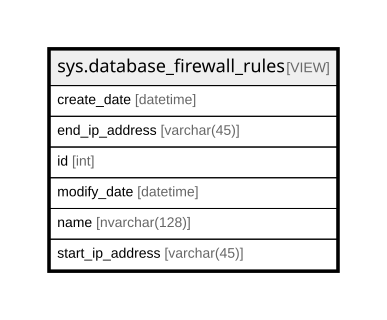

# sys.database_firewall_rules

## Description

<details>
<summary><strong>Table Definition</strong></summary>

```sql
CREATE VIEW sys.database_firewall_rules AS SELECT id, name, start_ip_address, end_ip_address, create_date, modify_date FROM sys.database_firewall_rules_table
```

</details>

## Columns

| Name             | Type          | Default | Nullable | Children | Parents | Comment |
| ---------------- | ------------- | ------- | -------- | -------- | ------- | ------- |
| create_date      | datetime      |         | false    |          |         |         |
| end_ip_address   | varchar(45)   |         | false    |          |         |         |
| id               | int           |         | false    |          |         |         |
| modify_date      | datetime      |         | false    |          |         |         |
| name             | nvarchar(128) |         | false    |          |         |         |
| start_ip_address | varchar(45)   |         | false    |          |         |         |

## Referenced Tables

| Name                                                                      | Columns | Comment | Type |
| ------------------------------------------------------------------------- | ------- | ------- | ---- |
| [sys.database_firewall_rules_table](sys.database_firewall_rules_table.md) | 0       |         |      |

## Relations



---

> Generated by [tbls](https://github.com/k1LoW/tbls)
