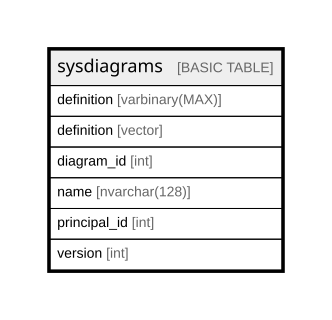

# sysdiagrams

## Columns

| Name         | Type           | Default | Nullable | Children | Parents | Comment |
| ------------ | -------------- | ------- | -------- | -------- | ------- | ------- |
| definition   | varbinary(MAX) |         | true     |          |         |         |
| definition   | vector         |         | true     |          |         |         |
| diagram_id   | int            |         | false    |          |         |         |
| name         | nvarchar(128)  |         | false    |          |         |         |
| principal_id | int            |         | false    |          |         |         |
| version      | int            |         | true     |          |         |         |

## Constraints

| Name              | Type        | Definition                                                                |
| ----------------- | ----------- | ------------------------------------------------------------------------- |
| PK__sysdiagr_*    | PRIMARY KEY | CLUSTERED, unique, part of a PRIMARY KEY constraint, [ diagram_id ]       |
| UK_principal_name | UNIQUE      | NONCLUSTERED, unique, part of a UNIQUE constraint, [ principal_id, name ] |

## Indexes

| Name              | Definition                                                                |
| ----------------- | ------------------------------------------------------------------------- |
| PK__sysdiagr_*    | CLUSTERED, unique, part of a PRIMARY KEY constraint, [ diagram_id ]       |
| UK_principal_name | NONCLUSTERED, unique, part of a UNIQUE constraint, [ principal_id, name ] |

## Relations

---

> Generated by [tbls](https://github.com/k1LoW/tbls)
