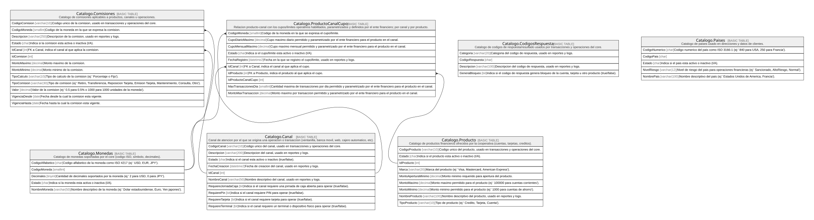

# Catalogo

## Description

Catalogos y dominios transversales compartidos por todos los modulos.

## Tables

| Name                                                        | Columns | Comment                                                                                                                                            | Type        |
| ----------------------------------------------------------- | ------- | -------------------------------------------------------------------------------------------------------------------------------------------------- | ----------- |
| [Catalogo.Canal](Catalogo.Canal.md)                         | 10      | Canal de atencion por el que se origina una operacion o transaccion (ventanilla, banca movil, web, cajero automatico, etc).                        | BASIC TABLE |
| [Catalogo.CodigosRespuesta](Catalogo.CodigosRespuesta.md)   | 4       | Catalogo de codigos de respuesta/resultado usados por transacciones y operaciones del core.                                                        | BASIC TABLE |
| [Catalogo.Comisiones](Catalogo.Comisiones.md)               | 13      | Catalogo de comisiones aplicables a productos, canales u operaciones.                                                                              | BASIC TABLE |
| [Catalogo.Monedas](Catalogo.Monedas.md)                     | 5       | Catalogo de monedas soportadas por el core (codigo ISO, simbolo, decimales).                                                                       | BASIC TABLE |
| [Catalogo.Paises](Catalogo.Paises.md)                       | 5       | Catalogo de paises usado en direcciones y datos de clientes.                                                                                       | BASIC TABLE |
| [Catalogo.Producto](Catalogo.Producto.md)                   | 9       | Catalogo de productos financieros ofrecidos por la cooperativa (cuentas, tarjetas, creditos).                                                      | BASIC TABLE |
| [Catalogo.ProductoCanalCupo](Catalogo.ProductoCanalCupo.md) | 10      | Relacion producto-canal con los cupos/limites operativos habilitados, parametrizados y definidos por el ente financiero; por canal y por producto. | BASIC TABLE |

## Relations

---

> Generated by [tbls](https://github.com/k1LoW/tbls)
