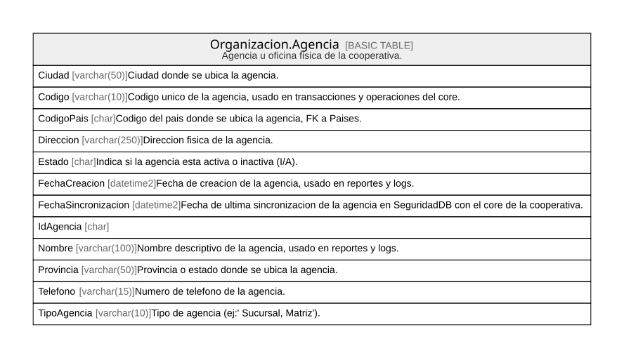

# Organizacion

## Description

Estructura administrativa/fisica de la cooperativa.

## Tables

| Name                                            | Columns | Comment                                     | Type        |
| ----------------------------------------------- | ------- | ------------------------------------------- | ----------- |
| [Organizacion.Agencia](Organizacion.Agencia.md) | 12      | Agencia u oficina fisica de la cooperativa. | BASIC TABLE |

## Relations

---

> Generated by [tbls](https://github.com/k1LoW/tbls)
