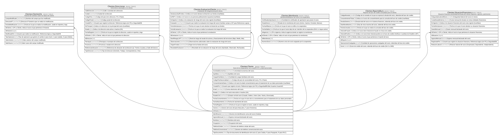

# Clientes

## Description

Datos del socio y su perfil de riesgo/cumplimiento.

## Tables

| Name                                                            | Columns | Comment                                                                                | Type        |
| --------------------------------------------------------------- | ------- | -------------------------------------------------------------------------------------- | ----------- |
| [Clientes.Cliente](Clientes.Cliente.md)                         | 21      | Socio de la cooperativa, con su perfil KYC y datos personales.                         | BASIC TABLE |
| [Clientes.ClientesHis](Clientes.ClientesHis.md)                 | 9       | Historial de cambios sobre los datos del cliente.                                      | BASIC TABLE |
| [Clientes.Direcciones](Clientes.Direcciones.md)                 | 14      | Direcciones asociadas a un cliente.                                                    | BASIC TABLE |
| [Clientes.EvaluacionCliente](Clientes.EvaluacionCliente.md)     | 12      | Evaluacion de riesgo/scoring del cliente.                                              | BASIC TABLE |
| [Clientes.Membresia](Clientes.Membresia.md)                     | 8       | Membresia/afiliacion del socio a la cooperativa.                                       | BASIC TABLE |
| [Clientes.ReporteBuro](Clientes.ReporteBuro.md)                 | 11      | Reporte de buro de credito consultado para el cliente.                                 | BASIC TABLE |
| [Clientes.SituacionFinanciera](Clientes.SituacionFinanciera.md) | 10      | Situacion financiera declarada/verificada del cliente (ingresos, egresos, patrimonio). | BASIC TABLE |

## Relations

---

> Generated by [tbls](https://github.com/k1LoW/tbls)
