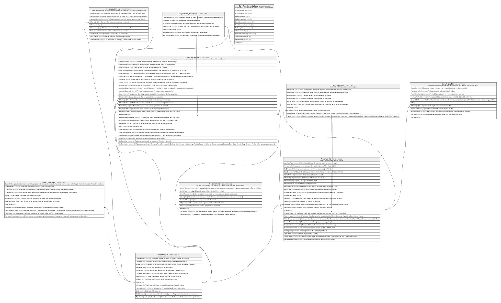

# Core

## Description

Cuentas, tarjetas, canales y el motor transaccional.

## Tables

| Name                                                      | Columns | Comment                                                                                                                                                               | Type        |
| --------------------------------------------------------- | ------- | --------------------------------------------------------------------------------------------------------------------------------------------------------------------- | ----------- |
| [Core.CanalCupo](Core.CanalCupo.md)                       | 11      | Cupos/limites operativos definidos por el titular/propietario de una cuenta por canal. Nunca superan los cupos definidos por el ente financiero en ProductoCanalCupo. | BASIC TABLE |
| [Core.Cuenta](Core.Cuenta.md)                             | 14      | Cuenta del socio (ahorro, corriente, etc.).                                                                                                                           | BASIC TABLE |
| [Core.Movimiento](Core.Movimiento.md)                     | 10      | Detalle de movimiento de saldo, ingreso o egreso de una cuenta asociado a una transaccion.                                                                            | BASIC TABLE |
| [Core.Tarjeta](Core.Tarjeta.md)                           | 27      | Tarjeta emitida asociada a una cuenta.                                                                                                                                | BASIC TABLE |
| [Core.TarjetaHis](Core.TarjetaHis.md)                     | 10      | Historial de cambios de estado de una tarjeta.                                                                                                                        | BASIC TABLE |
| [Core.TarjetaPin](Core.TarjetaPin.md)                     | 11      | PIN/credenciales de seguridad de una tarjeta (Evaluar si deberia estar en seguridad).                                                                                 | BASIC TABLE |
| [Core.Terminal](Core.Terminal.md)                         | 10      | Terminal fisico o logico (POS, cajero, etc.) desde el que se origina una operacion.                                                                                   | BASIC TABLE |
| [Core.Transaccion](Core.Transaccion.md)                   | 29      | Movimiento transaccional del core, todos los canales (incluida ventanilla via IdJornadaCaja).                                                                         | BASIC TABLE |
| [Core.TransaccionComision](Core.TransaccionComision.md)   | 7       | Comision cobrada sobre una transaccion.                                                                                                                               | BASIC TABLE |
| [Core.TransferenciaExterna](Core.TransferenciaExterna.md) | 12      | Transferencia hacia/desde una entidad externa a la cooperativa.                                                                                                       | BASIC TABLE |

## Relations

---

> Generated by [tbls](https://github.com/k1LoW/tbls)
