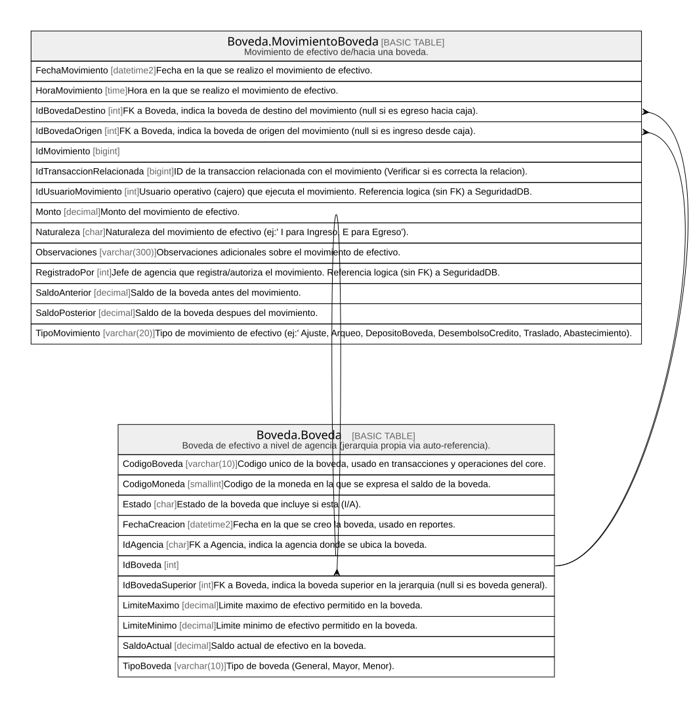

# Boveda

## Description

Efectivo a nivel boveda/agencia (no ventanilla).

## Tables

| Name                                                  | Columns | Comment                                                                       | Type        |
| ----------------------------------------------------- | ------- | ----------------------------------------------------------------------------- | ----------- |
| [Boveda.Boveda](Boveda.Boveda.md)                     | 11      | Boveda de efectivo a nivel de agencia (jerarquia propia via auto-referencia). | BASIC TABLE |
| [Boveda.MovimientoBoveda](Boveda.MovimientoBoveda.md) | 14      | Movimiento de efectivo de/hacia una boveda.                                   | BASIC TABLE |

## Relations

---

> Generated by [tbls](https://github.com/k1LoW/tbls)
