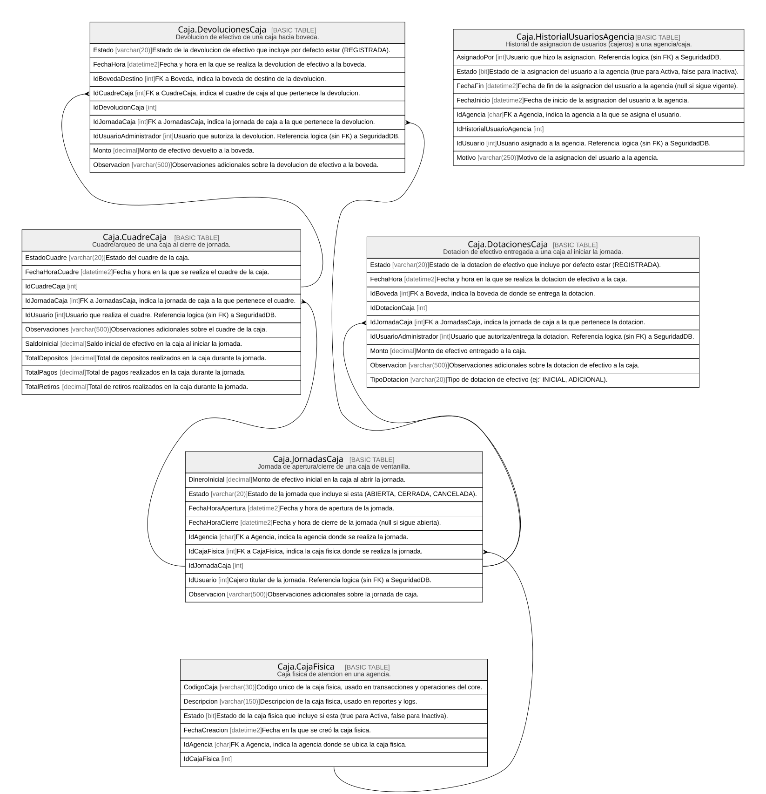

# Caja

## Description

Operacion de ventanilla, jornadas, dotaciones y cuadres.

## Tables

| Name                                                              | Columns | Comment                                                           | Type        |
| ----------------------------------------------------------------- | ------- | ----------------------------------------------------------------- | ----------- |
| [Caja.CajaFisica](Caja.CajaFisica.md)                             | 6       | Caja fisica de atencion en una agencia.                           | BASIC TABLE |
| [Caja.CuadreCaja](Caja.CuadreCaja.md)                             | 10      | Cuadre/arqueo de una caja al cierre de jornada.                   | BASIC TABLE |
| [Caja.DevolucionesCaja](Caja.DevolucionesCaja.md)                 | 9       | Devolucion de efectivo de una caja hacia boveda.                  | BASIC TABLE |
| [Caja.DotacionesCaja](Caja.DotacionesCaja.md)                     | 9       | Dotacion de efectivo entregada a una caja al iniciar la jornada.  | BASIC TABLE |
| [Caja.HistorialUsuariosAgencia](Caja.HistorialUsuariosAgencia.md) | 8       | Historial de asignacion de usuarios (cajeros) a una agencia/caja. | BASIC TABLE |
| [Caja.JornadasCaja](Caja.JornadasCaja.md)                         | 9       | Jornada de apertura/cierre de una caja de ventanilla.             | BASIC TABLE |

## Relations

---

> Generated by [tbls](https://github.com/k1LoW/tbls)
