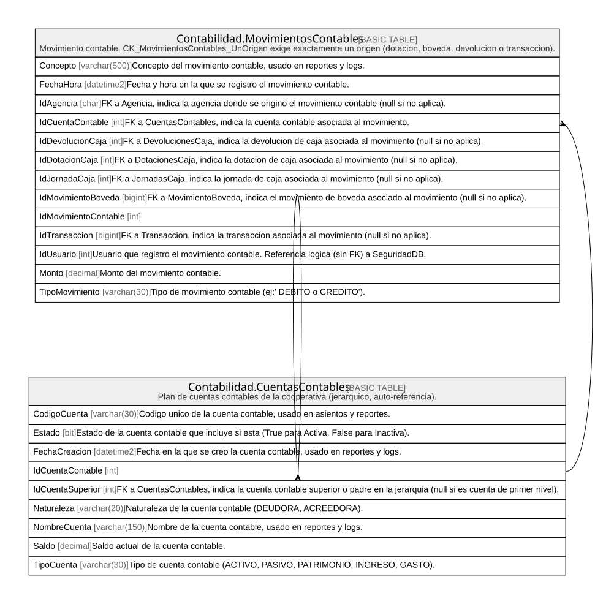

# Contabilidad

## Description

Plan de cuentas y asientos contables.

## Tables

| Name                                                                      | Columns | Comment                                                                                                                         | Type        |
| ------------------------------------------------------------------------- | ------- | ------------------------------------------------------------------------------------------------------------------------------- | ----------- |
| [Contabilidad.CuentasContables](Contabilidad.CuentasContables.md)         | 9       | Plan de cuentas contables de la cooperativa (jerarquico, auto-referencia).                                                      | BASIC TABLE |
| [Contabilidad.MovimientosContables](Contabilidad.MovimientosContables.md) | 13      | Movimiento contable. CK_MovimientosContables_UnOrigen exige exactamente un origen (dotacion, boveda, devolucion o transaccion). | BASIC TABLE |

## Relations

---

> Generated by [tbls](https://github.com/k1LoW/tbls)
