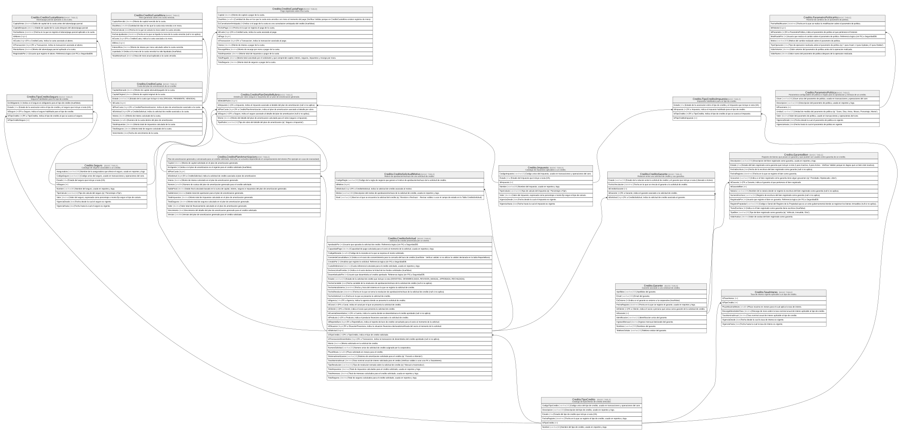

# Credito

## Description

Aprobacion de credito, plan de pagos, garantias y politica de riesgo.

## Tables

| Name                                                                  | Columns | Comment                                                                                                                                                                     | Type        |
| --------------------------------------------------------------------- | ------- | --------------------------------------------------------------------------------------------------------------------------------------------------------------------------- | ----------- |
| [Credito.CreditoCuota](Credito.CreditoCuota.md)                       | 11      | Cuota del plan de amortizacion de un credito.                                                                                                                               | BASIC TABLE |
| [Credito.CreditoCuotaAbono](Credito.CreditoCuotaAbono.md)             | 8       | Abono/pago parcial aplicado a una cuota.                                                                                                                                    | BASIC TABLE |
| [Credito.CreditoCuotaMora](Credito.CreditoCuotaMora.md)               | 9       | Mora generada sobre una cuota vencida.                                                                                                                                      | BASIC TABLE |
| [Credito.CreditoCuotaPago](Credito.CreditoCuotaPago.md)               | 12      | Pago registrado sobre una cuota.                                                                                                                                            | BASIC TABLE |
| [Credito.CreditoGarante](Credito.CreditoGarante.md)                   | 5       | Relacion entre una solicitud de credito y sus garantes.                                                                                                                     | BASIC TABLE |
| [Credito.CreditoPlanAmortizacion](Credito.CreditoPlanAmortizacion.md) | 13      | Plan de amortizacion generado y versionado para un credito solicitado, este plan se actualiza dependiendo el comportamiento del cliente (Por ejemplo en caso de morosidad). | BASIC TABLE |
| [Credito.CreditoPlanDetalleRubro](Credito.CreditoPlanDetalleRubro.md) | 6       | Detalle por rubro (seguro o impuesto) de un plan de amortizacion generado.                                                                                                  | BASIC TABLE |
| [Credito.CreditoSolicitud](Credito.CreditoSolicitud.md)               | 32      | Solicitud de credito presentada por un cliente.                                                                                                                             | BASIC TABLE |
| [Credito.CreditoSolicitudMotivo](Credito.CreditoSolicitudMotivo.md)   | 5       | Motivo de aprobacion/rechazo de una solicitud de credito.                                                                                                                   | BASIC TABLE |
| [Credito.Garante](Credito.Garante.md)                                 | 10      | Garante asociado a una solicitud de credito.                                                                                                                                | BASIC TABLE |
| [Credito.GaranteBien](Credito.GaranteBien.md)                         | 14      | Registro de bienes que posee un garante y que pueden ser usados como garantia de un credito.                                                                                | BASIC TABLE |
| [Credito.Impuesto](Credito.Impuesto.md)                               | 8       | Catalogo de impuestos aplicables a un credito.                                                                                                                              | BASIC TABLE |
| [Credito.ParametroPolitica](Credito.ParametroPolitica.md)             | 7       | Parametros configurables de politica o reglas para la aprobacion y rechazo de un credito.                                                                                   | BASIC TABLE |
| [Credito.ParametroPoliticaHis](Credito.ParametroPoliticaHis.md)       | 8       | Historial de cambios de un parametro de politica.                                                                                                                           | BASIC TABLE |
| [Credito.Seguro](Credito.Seguro.md)                                   | 9       | Catalogo de seguros asociables a un credito.                                                                                                                                | BASIC TABLE |
| [Credito.TasaInteres](Credito.TasaInteres.md)                         | 7       | Tasa de interes vigente aplicable a un tipo de credito.                                                                                                                     | BASIC TABLE |
| [Credito.TipoCredito](Credito.TipoCredito.md)                         | 6       | Catalogo de tipos/lineas de credito ofrecidas.                                                                                                                              | BASIC TABLE |
| [Credito.TipoCreditoImpuesto](Credito.TipoCreditoImpuesto.md)         | 4       | Impuestos habilitados para un tipo de credito.                                                                                                                              | BASIC TABLE |
| [Credito.TipoCreditoSeguro](Credito.TipoCreditoSeguro.md)             | 5       | Seguros habilitados para un tipo de credito.                                                                                                                                | BASIC TABLE |

## Relations

---

> Generated by [tbls](https://github.com/k1LoW/tbls)
